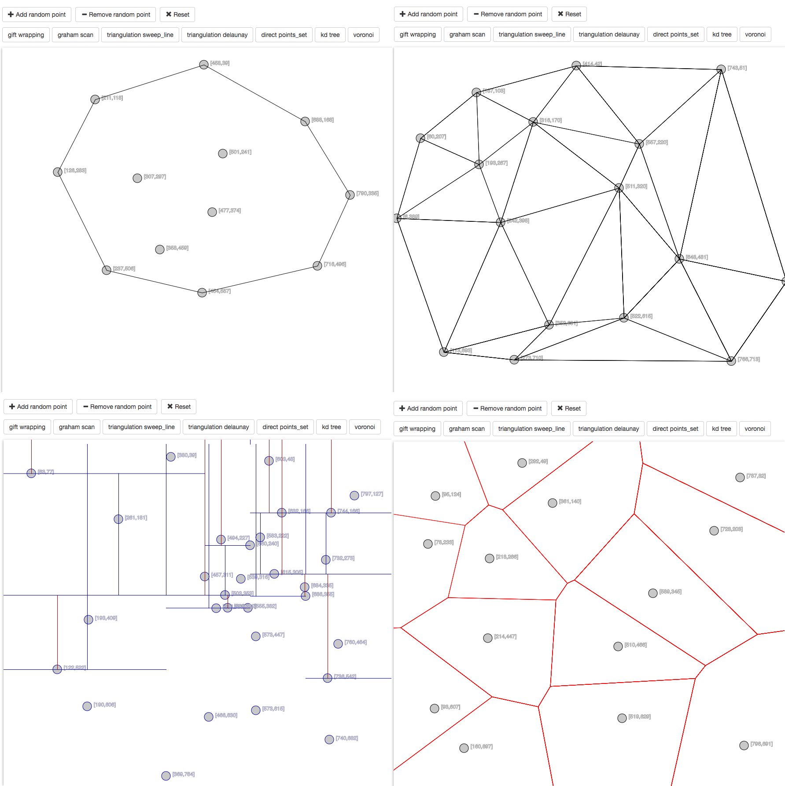

# ProcessingJs
Application using library [p5.js](https://p5js.org/) (enables using Processing framework in web browsers) to demonstrate few geometrical algorithms in attractive way.

## Implemented algorithms
### Convex hull
1. Gift wrapping
  * Most simple algorithm for computing convex hull of given set.
2. Graham scan
  * Computing convex hull using sweep line.

### Triangulation
1. Sweep Line
2. Delaunay

### Possibility to set points in user defined order

### Orthogonal searching
1. KD tree

### Diagrams
1. Voronoi diagram

## Examples of output

